= Lista de Exercícios - Processamento Digital de Imagens (2026.2)
Maria Clara Moura de Freitas (20230093652) <maria.clarafreitas@hotmail.com>
:toc:
:icons: font
:url-quickref: https://docs.asciidoctor.org/asciidoc/latest/syntax-quick-reference/

Esta página documenta os exercícios desenvolvidos para a disciplina de Processamento Digital de Imagens, ofertada pela UFRN no semestre 2026.2. 

Todos os códigos estão disponiveis em meu https://github.com/mclarafreitas/pdi[Github,role=external,window=_blank] e todos os exercicios estão localizados na página pessoal do professor https://agostinhobritojr.github.io/tutorial/pdi/[Agostinho Brito,role=external,window=_blank].

== Capítulo 2

```
=== Exercício 1
A tarefa consiste em implementar o programa regions.cpp, utilizando o pixels.cpp como referência, para solicitar as coordenadas de dois pontos da imagem e aplicar o efeito de negativo (255 - pixel) na região retangular delimitada por eles, mantendo o restante da imagem inalterado; para isso, foi utilizada a biblioteca OpenCV, carregando a imagem em escala de cinza, validando as coordenadas e invertendo os pixels da região selecionada.
```
[pixels.cpp]
#include <iostream>
#include <opencv2/opencv.hpp>

int main(int, char**) {
  cv::Mat image;
  cv::Vec3b val;

  image = cv::imread("bolhas.png", cv::IMREAD_GRAYSCALE);
  if (!image.data) std::cout << "nao abriu bolhas.png" << std::endl;

  cv::namedWindow("janela", cv::WINDOW_AUTOSIZE);

  for (int i = 200; i < 210; i++) {
    for (int j = 10; j < 200; j++) {
      image.at<uchar>(i, j) = 0;
    }
  }

  cv::imshow("janela", image);
  cv::waitKey();

  image = cv::imread("bolhas.png", cv::IMREAD_COLOR);

  val[0] = 0;    // B
  val[1] = 0;    // G
  val[2] = 255;  // R

  for (int i = 200; i < 210; i++) {
    for (int j = 10; j < 200; j++) {
      image.at<cv::Vec3b>(i, j) = val;
    }
  }

  cv::imshow("janela", image);
  cv::waitKey();
  return 0;
}

```

```
[regions.cpp]
#include <iostream>
#include <opencv2/opencv.hpp>

int main(int, char**) {

    cv::Mat image;

    // Abre a imagem em tons de cinza
    image = cv::imread("bolhas.png", cv::IMREAD_GRAYSCALE);

    if (!image.data) {
        std::cout << "Nao abriu bolhas.png" << std::endl;
        return -1;
    }

    // Dimensoes da imagem
    int largura = image.cols;
    int altura = image.rows;

    std::cout << "Tamanho da imagem: "
              << largura << " x " << altura << std::endl;

    // Coordenadas dos dois pontos
    int x1, y1, x2, y2;

    std::cout << "Digite as coordenadas do primeiro ponto (x y): ";
    std::cin >> x1 >> y1;

    std::cout << "Digite as coordenadas do segundo ponto (x y): ";
    std::cin >> x2 >> y2;

    // Verifica se as coordenadas estao dentro da imagem
    if (x1 < 0 || x1 >= largura ||
        x2 < 0 || x2 >= largura ||
        y1 < 0 || y1 >= altura ||
        y2 < 0 || y2 >= altura) {

        std::cout << "Coordenadas fora dos limites da imagem!"
                  << std::endl;

        return -1;
    }

    // Garante que x1 <= x2 e y1 <= y2
    int xmin = std::min(x1, x2);
    int xmax = std::max(x1, x2);
    int ymin = std::min(y1, y2);
    int ymax = std::max(y1, y2);

    // Inverte os pixels dentro da regiao
    for (int y = ymin; y <= ymax; y++) {
        for (int x = xmin; x <= xmax; x++) {

            image.at<uchar>(y, x) =
                255 - image.at<uchar>(y, x);
        }
    }

    // Exibe a imagem
    cv::namedWindow("janela", cv::WINDOW_AUTOSIZE);
    cv::imshow("janela", image);
    cv::waitKey();

    return 0;
}
```
.Saída do programa regions.cpp utilizando as coordenadas do primeiro ponto x. y como 100 100 e do segundo ponto 200 200
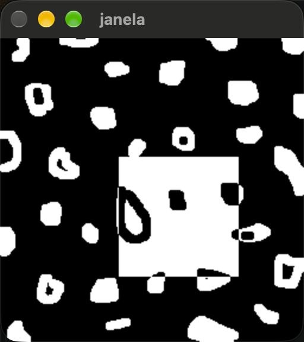

=== Exercício 2
A tarefa consiste em implementar o programa trocaregioes.cpp, utilizando o pixels.cpp como referência, para dividir a imagem em quatro quadrantes e trocar entre si os quadrantes que estão em diagonal, utilizando a classe cv::Mat para criar e manipular as regiões da imagem; a implementação considera que as dimensões da imagem são múltiplas de 2, facilitando a divisão e a troca dos quadrantes.
```
[trocaregioes.cpp]
#include <iostream>
#include <opencv2/opencv.hpp>

int main(int, char**) {

    cv::Mat image;

    // Carrega a imagem em escala de cinza
    image = cv::imread("bolhas.png", cv::IMREAD_GRAYSCALE);

    if (!image.data) {
        std::cout << "Nao abriu bolhas.png" << std::endl;
        return -1;
    }

    // Dimensoes da imagem
    int largura = image.cols;
    int altura = image.rows;

    // Como a imagem possui dimensoes multiplas de 2,
    // podemos dividir largura e altura pela metade.
    int metadeLargura = largura / 2;
    int metadeAltura = altura / 2;

    // Cria os quatro quadrantes da imagem usando cv::Mat e cv::Rect
    cv::Mat superiorEsquerdo(
        image,
        cv::Rect(0, 0, metadeLargura, metadeAltura)
    );

    cv::Mat superiorDireito(
        image,
        cv::Rect(metadeLargura, 0, metadeLargura, metadeAltura)
    );

    cv::Mat inferiorEsquerdo(
        image,
        cv::Rect(0, metadeAltura, metadeLargura, metadeAltura)
    );

    cv::Mat inferiorDireito(
        image,
        cv::Rect(metadeLargura, metadeAltura,
                 metadeLargura, metadeAltura)
    );

    // Guarda temporariamente os quadrantes antes da troca
    cv::Mat tempSuperiorEsquerdo = superiorEsquerdo.clone();
    cv::Mat tempSuperiorDireito = superiorDireito.clone();

    // Troca os quadrantes na diagonal
    inferiorDireito.copyTo(superiorEsquerdo);
    tempSuperiorEsquerdo.copyTo(inferiorDireito);

    inferiorEsquerdo.copyTo(superiorDireito);
    tempSuperiorDireito.copyTo(inferiorEsquerdo);

    // Exibe a imagem modificada
    cv::namedWindow("janela", cv::WINDOW_AUTOSIZE);
    cv::imshow("janela", image);
    cv::waitKey();

    return 0;
}
```

.Saída do programa trocaregioes.cpp
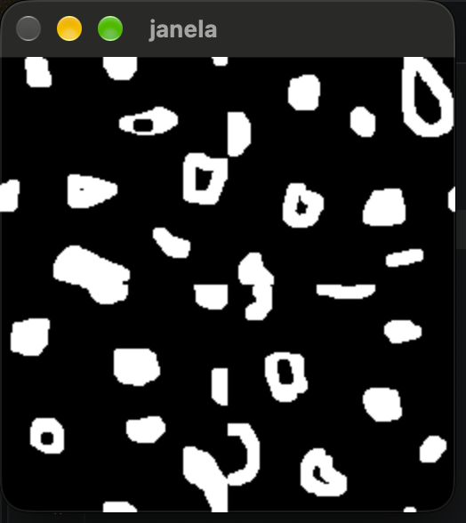


== Capítulo 3
=== Exercício 1
O programa foi adaptado para converter cada frame do vídeo original, inicialmente no espaço de cores BGR, para tons de cinza utilizando a função cv::cvtColor(). Os frames convertidos são então armazenados no arquivo output_gray.avi por meio do VideoWriter. Dessa forma, o vídeo de saída apresenta somente informações de intensidade luminosa, sem informações de cor.

``` 
[video_gray.c]
#include <iostream>
#include <opencv2/opencv.hpp>

int main(int argc, char** argv) {

    if (argc < 2) {
        std::cout << "Uso: ./video_gray <video>\n";
        return -1;
    }

    cv::VideoCapture cap(argv[1]);

    if (!cap.isOpened()) {
        std::cout << "Erro ao abrir o video: " << argv[1] << "\n";
        return -1;
    }

    int width = static_cast<int>(cap.get(cv::CAP_PROP_FRAME_WIDTH));
    int height = static_cast<int>(cap.get(cv::CAP_PROP_FRAME_HEIGHT));
    double fps = cap.get(cv::CAP_PROP_FPS);

    std::cout << "Largura: " << width << "\n";
    std::cout << "Altura: " << height << "\n";
    std::cout << "FPS: " << fps << "\n";

    cv::Size frameSize(width, height);

    // Codec MJPG
    cv::VideoWriter out(
        "output_gray.avi",
        cv::VideoWriter::fourcc('M', 'J', 'P', 'G'),
        fps,
        frameSize,
        false
    );

    if (!out.isOpened()) {
        std::cout << "Erro ao criar o video de saida!\n";
        return -1;
    }

    cv::Mat frame;
    cv::Mat gray;

    int counter = 0;

    while (cap.read(frame)) {

        // Converte BGR para tons de cinza
        cv::cvtColor(frame, gray, cv::COLOR_BGR2GRAY);

        // Grava o frame em tons de cinza
        out.write(gray);

        // Mostra o resultado
        cv::imshow("Video em tons de cinza", gray);

        counter++;

        // Pressione ESC para interromper
        if (cv::waitKey(30) == 27)
            break;
    }

    std::cout << "Numero de frames: " << counter << "\n";

    cap.release();
    out.release();
    cv::destroyAllWindows();

    return 0;
}
```
.Resultado
++++
<video controls width="640">
  <source src="output_gray.avi" type="video/avi">
</video>
++++

=== Exercício 2
O programa foi adaptado para aplicar o efeito de negativo em cada quadro do vídeo antes de armazená-lo no arquivo de saída. Para isso, foi utilizada a função cv::bitwise_not(), que inverte os valores dos pixels da imagem. Dessa forma, os valores de intensidade são transformados de acordo com a relação \(I_{negativo}=255-I\), produzindo o efeito de negativo no vídeo. O vídeo resultante foi armazenado no arquivo output_negative.avi.
```
[video_negative.c]

#include <iostream>
#include <opencv2/opencv.hpp>

int main(int argc, char** argv) {

    if (argc < 2) {
        std::cout << "Uso: ./video_negative <video>\n";
        return -1;
    }

    cv::VideoCapture cap(argv[1]);

    if (!cap.isOpened()) {
        std::cout << "Erro ao abrir o video!\n";
        return -1;
    }

    int width = static_cast<int>(cap.get(cv::CAP_PROP_FRAME_WIDTH));
    int height = static_cast<int>(cap.get(cv::CAP_PROP_FRAME_HEIGHT));
    double fps = cap.get(cv::CAP_PROP_FPS);

    std::cout << "Largura = " << width << "\n";
    std::cout << "Altura = " << height << "\n";
    std::cout << "FPS = " << fps << "\n";

    cv::Size frameSize(width, height);

    cv::VideoWriter out(
        "output_negative.avi",
        cv::VideoWriter::fourcc('M', 'J', 'P', 'G'),
        fps,
        frameSize,
        true
    );

    if (!out.isOpened()) {
        std::cout << "Erro ao criar o video de saida!\n";
        return -1;
    }

    cv::Mat frame;
    cv::Mat negative;

    int counter = 0;

    while (cap.read(frame)) {

        // Aplica o negativo ao frame
        cv::bitwise_not(frame, negative);

        // Grava o frame negativo
        out.write(negative);

        // Mostra o resultado
        cv::imshow("Video negativo", negative);

        counter++;

        // Pressione ESC para encerrar
        if (cv::waitKey(30) == 27)
            break;
    }

    std::cout << "Numero de frames: " << counter << "\n";

    cap.release();
    out.release();
    cv::destroyAllWindows();

    return 0;
}
```
.Resultado
++++
<video controls width="640">
  <source src="output_negative.avi" type="video/avi">
</video>
++++

== Capítulo 5
=== Exercício 1
Ao comparar uma linha das imagens armazenadas em YML e PNG, observa-se que a diferença não é exatamente zero, embora visualmente as imagens sejam praticamente iguais. Isso ocorre porque o YML armazena a matriz em ponto flutuante (CV_32FC1), preservando os valores calculados pela senoide, enquanto o PNG é normalizado para o intervalo [0,255] e convertido para CV_8U. Essa conversão provoca quantização dos valores, fazendo com que pequenas diferenças apareçam entre os pixels correspondentes.
```
[filestorage.cpp]
#include <iostream>
#include <opencv2/opencv.hpp>
#include <fstream>
#include <cmath>

using namespace std;

const int SIDE = 256;
const int PERIODOS = 4;
const double PI = 3.14159265358979323846;

int main() {

    string ymlFile = "senoide-256.yml";
    string pngFile = "senoide-256.png";

    // -------------------------------------------------
    // 1. Criar a imagem em ponto flutuante
    // -------------------------------------------------

    cv::Mat image = cv::Mat::zeros(SIDE, SIDE, CV_32FC1);

    for (int i = 0; i < SIDE; i++) {
        for (int j = 0; j < SIDE; j++) {

            image.at<float>(i, j) =
                127.0f * sin(2.0 * PI * PERIODOS * j / SIDE)
                + 128.0f;
        }
    }

    // -------------------------------------------------
    // 2. Salvar a imagem original no YML
    // -------------------------------------------------

    cv::FileStorage fs(ymlFile, cv::FileStorage::WRITE);

    if (!fs.isOpened()) {
        cerr << "Erro ao abrir o arquivo YML." << endl;
        return -1;
    }

    fs << "mat" << image;
    fs.release();

    // -------------------------------------------------
    // 3. Preparar e salvar a imagem como PNG
    // -------------------------------------------------

    cv::Mat imagePNG;

    cv::normalize(
        image,
        imagePNG,
        0,
        255,
        cv::NORM_MINMAX
    );

    imagePNG.convertTo(imagePNG, CV_8U);

    if (!cv::imwrite(pngFile, imagePNG)) {
        cerr << "Erro ao salvar PNG." << endl;
        return -1;
    }

    // -------------------------------------------------
    // 4. Ler novamente o YML
    // -------------------------------------------------

    cv::Mat imageYML;

    fs.open(ymlFile, cv::FileStorage::READ);

    if (!fs.isOpened()) {
        cerr << "Erro ao abrir YML para leitura." << endl;
        return -1;
    }

    fs["mat"] >> imageYML;
    fs.release();

    // -------------------------------------------------
    // 5. Escolher uma linha para comparação
    // -------------------------------------------------

    int linha = 128;

    ofstream arquivoDiff("diferenca.txt");

    if (!arquivoDiff.is_open()) {
        cerr << "Erro ao criar diferenca.txt." << endl;
        return -1;
    }

    // -------------------------------------------------
    // 6. Comparar YML x PNG
    // -------------------------------------------------

    double maxDiff = 0.0;
    double somaDiff = 0.0;

    for (int j = 0; j < SIDE; j++) {

        float valorYML = imageYML.at<float>(linha, j);
        float valorPNG = imagePNG.at<uchar>(linha, j);

        float diferenca = valorYML - valorPNG;

        arquivoDiff << j << " " << diferenca << endl;

        maxDiff = max(maxDiff, abs((double)diferenca));
        somaDiff += abs((double)diferenca);
    }

    arquivoDiff.close();

    cout << "Imagem gerada: " << pngFile << endl;
    cout << "Arquivo YML: " << ymlFile << endl;
    cout << "Linha comparada: " << linha << endl;
    cout << "Maior diferenca absoluta: " << maxDiff << endl;
    cout << "Diferenca absoluta media: "
         << somaDiff / SIDE << endl;

    // -------------------------------------------------
    // 7. Mostrar as imagens
    // -------------------------------------------------

    cv::imshow("Senoide", imagePNG);
    cv::waitKey(0);

    return 0;
}
```

.Exercício 5.2
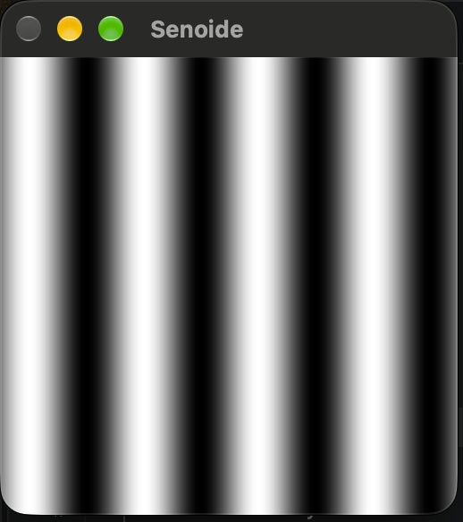


== Capítulo 6

=== Exercício 1
Foram aplicados cinco colormaps diferentes (`AUTUMN`, `BONE`, `HOT`, `OCEAN` e `VIRIDIS`) à imagem original para comparar seus efeitos.
```
[colormap.cpp]
#include <opencv2/opencv.hpp>
#include <iostream>

int main(int argc, const char *argv[]) {

    cv::Mat image, imagecolor;

    image = cv::imread(argv[1], cv::IMREAD_GRAYSCALE);

    if (!image.data) {
        std::cout << "Nao abriu a imagem" << std::endl;
        return -1;
    }

    // AUTUMN
    cv::applyColorMap(image, imagecolor, cv::COLORMAP_AUTUMN);
    cv::imshow("colormap_autumn", imagecolor);
    cv::waitKey(0);

    // BONE
    cv::applyColorMap(image, imagecolor, cv::COLORMAP_BONE);
    cv::imshow("colormap_bone", imagecolor);
    cv::waitKey(0);

    // HOT
    cv::applyColorMap(image, imagecolor, cv::COLORMAP_HOT);
    cv::imshow("colormap_hot", imagecolor);
    cv::waitKey(0);

    // OCEAN
    cv::applyColorMap(image, imagecolor, cv::COLORMAP_OCEAN);
    cv::imshow("colormap_ocean", imagecolor);
    cv::waitKey(0);

    // VIRIDIS
    cv::applyColorMap(image, imagecolor, cv::COLORMAP_VIRIDIS);
    cv::imshow("colormap_viridis", imagecolor);
    cv::waitKey(0);

    return 0;
}

```
.Exercício 6.1
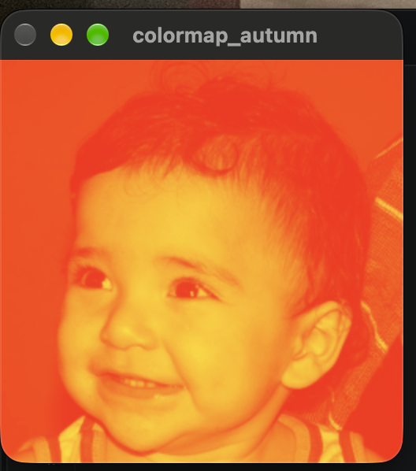
.Exercício 6.1
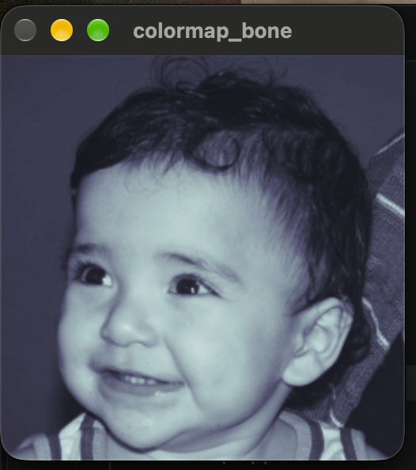
.Exercício 6.1
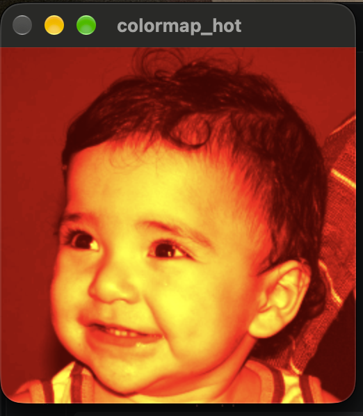
.Exercício 6.1
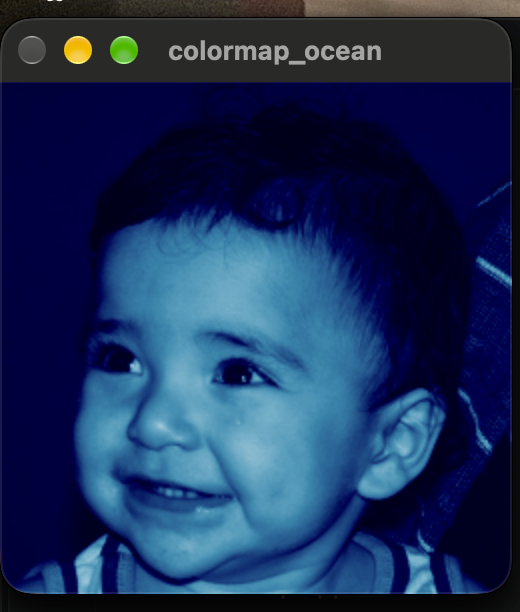
.Exercício 6.1
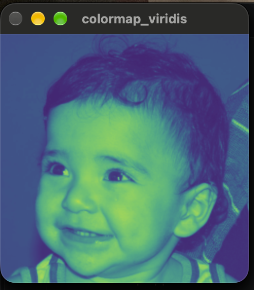

=== Exercício 2
Foi criada uma LUT com 256 cores, com transição de azul para vermelho, e aplicada à imagem utilizando `cv::applyColorMap`.
```
[colormap_personalizado.cpp]

#include <opencv2/opencv.hpp>
#include <iostream>

int main(int argc, const char *argv[]) {

    if (argc < 2) {
        std::cout << "Uso: ./colormap_personalizado imagem.png" << std::endl;
        return -1;
    }

    cv::Mat image, imagecolor;

    // Abre a imagem em tons de cinza
    image = cv::imread(argv[1], cv::IMREAD_GRAYSCALE);

    if (!image.data) {
        std::cout << "Nao abriu a imagem" << std::endl;
        return -1;
    }

    // Cria uma LUT com 256 cores
    cv::Mat lut(256, 1, CV_8UC3);

    // Cria o colormap personalizado
    for (int i = 0; i < 256; i++) {

        if (i < 64) {
            // Azul -> Ciano
            lut.at<cv::Vec3b>(i)[0] = 255;
            lut.at<cv::Vec3b>(i)[1] = i * 4;
            lut.at<cv::Vec3b>(i)[2] = 0;

        } else if (i < 128) {
            // Ciano -> Verde
            lut.at<cv::Vec3b>(i)[0] = 255 - (i - 64) * 4;
            lut.at<cv::Vec3b>(i)[1] = 255;
            lut.at<cv::Vec3b>(i)[2] = 0;

        } else if (i < 192) {
            // Verde -> Amarelo
            lut.at<cv::Vec3b>(i)[0] = 0;
            lut.at<cv::Vec3b>(i)[1] = 255;
            lut.at<cv::Vec3b>(i)[2] = (i - 128) * 4;

        } else {
            // Amarelo -> Vermelho
            lut.at<cv::Vec3b>(i)[0] = 0;
            lut.at<cv::Vec3b>(i)[1] = 255 - (i - 192) * 4;
            lut.at<cv::Vec3b>(i)[2] = 255;
        }
    }

    // Aplica o colormap personalizado
    cv::applyColorMap(image, imagecolor, lut);

    // Exibe o resultado
    cv::imshow("Colormap personalizado", imagecolor);

    cv::waitKey(0);

    return 0;
}
```
.Exercício 6.2
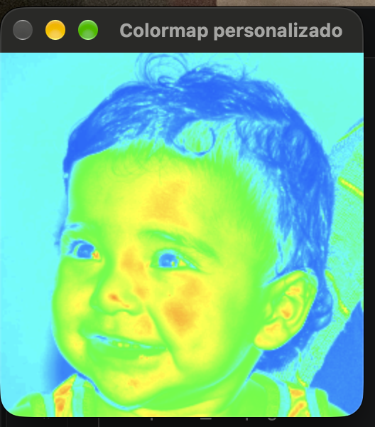

== Capítulo 7

=== Exercício 1
Foram utilizados cinco colormaps disponíveis no OpenCV: JET, OCEAN, PINK, TWILIGHT e TURBO. Cada um foi aplicado ao canal H (matiz) da imagem convertida para o espaço de cores HSV. Os resultados demonstram como diferentes mapas de cores podem representar os valores de intensidade do canal H de maneiras distintas, facilitando a visualização das informações presentes na imagem.
```
[colorspace.cpp]

#include <iostream>
#include <opencv2/opencv.hpp>
#include <vector>

int main(int argc, char** argv) {

    cv::Mat image;
    cv::Mat hsv;
    cv::Mat h, s, v;

    std::vector<cv::Mat> planes;

    if (argc != 2) {
        std::cerr << "Uso: " << argv[0] << " <Image_Path>\n";
        return -1;
    }

    image = cv::imread(argv[1], cv::IMREAD_COLOR);

    if (!image.data) {
        std::cerr << "Nao abriu " << argv[1] << std::endl;
        return -1;
    }

    // Exibe imagem original
    cv::namedWindow("Imagem original", cv::WINDOW_NORMAL);
    cv::imshow("Imagem original", image);

    // Converte para HSV
    cv::cvtColor(image, image, cv::COLOR_BGR2HSV_FULL);

    // Separa os canais H, S e V
    cv::split(image, planes);

    h = planes[0];
    s = planes[1];
    v = planes[2];

    // Aplica 5 colormaps diferentes ao canal H

    cv::Mat jet;
    cv::applyColorMap(h, jet, cv::COLORMAP_JET);
    cv::imshow("JET", jet);

    cv::Mat ocean;
    cv::applyColorMap(h, ocean, cv::COLORMAP_OCEAN);
    cv::imshow("OCEAN", ocean);

    cv::Mat pink;
    cv::applyColorMap(h, pink, cv::COLORMAP_PINK);
    cv::imshow("PINK", pink);

    cv::Mat twilight;
    cv::applyColorMap(h, twilight, cv::COLORMAP_TWILIGHT);
    cv::imshow("TWILIGHT", twilight);

    cv::Mat turbo;
    cv::applyColorMap(h, turbo, cv::COLORMAP_TURBO);
    cv::imshow("TURBO", turbo);

    cv::waitKey();

    return 0;
}
```
.Exercício 7.1
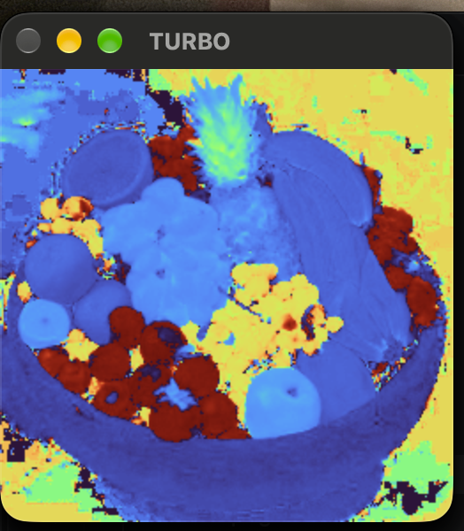

=== Exercício 2
Foi implementado um colormap personalizado utilizando a função cv::applyColorMap() do OpenCV. Diferentemente dos mapas de cores predefinidos, foi criada uma LUT (Look-Up Table) contendo 256 cores, correspondentes aos possíveis valores de intensidade de uma imagem em tons de cinza.

O colormap desenvolvido foi denominado “Ocean Fire”. Para baixas intensidades foram utilizadas cores frias, variando de azul escuro para azul. Nas intensidades intermediárias, as cores passam de azul para roxo e, posteriormente, para vermelho. Para as maiores intensidades, a cor passa de vermelho para amarelo.

Dessa forma, o mapa permite visualizar as diferentes intensidades da imagem através de uma transição gradual entre cores frias e quentes. A tabela personalizada foi criada com o tipo CV_8UC3 e 256 posições, conforme especificado pela documentação do OpenCV para a utilização de um userColor.

```
[colorspace_custom.cpp]
#include <iostream>
#include <opencv2/opencv.hpp>

int main(int argc, char** argv) {

    cv::Mat image, imageColor;

    if (argc != 2) {
        std::cerr << "Uso: " << argv[0] << " <Image_Path>\n";
        return -1;
    }

    // Abre a imagem em tons de cinza
    image = cv::imread(argv[1], cv::IMREAD_GRAYSCALE);

    if (image.empty()) {
        std::cerr << "Nao abriu " << argv[1] << std::endl;
        return -1;
    }

    // Cria uma LUT com 256 cores
    // 256 linhas x 1 coluna, 3 canais (BGR)
    cv::Mat colormap(256, 1, CV_8UC3);

    for (int i = 0; i < 256; i++) {

        uchar B, G, R;

        if (i < 64) {
            // Azul escuro -> Azul
            B = 80 + i * 175 / 63;
            G = 0;
            R = 0;
        }
        else if (i < 128) {
            // Azul -> Roxo
            B = 255;
            G = 0;
            R = (i - 64) * 180 / 63;
        }
        else if (i < 192) {
            // Roxo -> Vermelho
            B = 255 - (i - 128) * 255 / 63;
            G = 0;
            R = 180 + (i - 128) * 75 / 63;
        }
        else {
            // Vermelho -> Amarelo
            B = 0;
            G = (i - 192) * 255 / 63;
            R = 255;
        }

        colormap.at<cv::Vec3b>(i, 0) = cv::Vec3b(B, G, R);
    }

    // Aplica o colormap personalizado
    cv::applyColorMap(image, imageColor, colormap);

    // Exibe a imagem original
    cv::namedWindow("Imagem original", cv::WINDOW_NORMAL);
    cv::imshow("Imagem original", image);

    // Exibe a imagem colorida
    cv::namedWindow("Colormap personalizado", cv::WINDOW_NORMAL);
    cv::imshow("Colormap personalizado", imageColor);

    cv::waitKey(0);

    return 0;
}
```
.Exercício 7.2
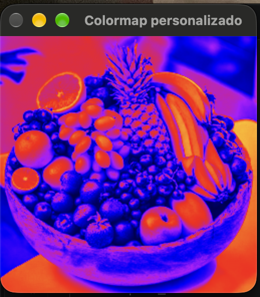

== Capítulo 8

=== Exercício 1
O objetivo foi implementar uma seleção interativa de pixels baseada no programa colorrange.cpp, permitindo adicionar pixels com o botão esquerdo e removê-los com o botão direito. A partir dos pixels selecionados, foi calculada uma faixa de cores utilizada para segmentar a imagem com inRange(), permitindo identificar regiões com cores semelhantes, como a bola presente na imagem.
```
[interativo2.cpp]
#include <iostream>
#include <opencv2/opencv.hpp>

cv::Mat image;
cv::Mat selectedMask;
cv::Mat colorMask;

bool painting = false;
bool removing = false;

cv::Point previousPoint;


// ---------------------------------------------------------
// Mouse
// ---------------------------------------------------------

static void onMouse(int event, int x, int y, int flags, void*)
{
    // Botão esquerdo: adicionar
    if (event == cv::EVENT_LBUTTONDOWN)
    {
        painting = true;
        removing = false;

        previousPoint = cv::Point(x, y);

        cv::circle(
            selectedMask,
            cv::Point(x, y),
            8,
            cv::Scalar(255),
            -1
        );
    }

    // Botão direito: remover
    else if (event == cv::EVENT_RBUTTONDOWN)
    {
        painting = true;
        removing = true;

        previousPoint = cv::Point(x, y);

        cv::circle(
            selectedMask,
            cv::Point(x, y),
            8,
            cv::Scalar(0),
            -1
        );
    }

    // Arrastando o mouse
    else if (event == cv::EVENT_MOUSEMOVE && painting)
    {
        cv::Point currentPoint(x, y);

        if (removing)
        {
            // Remove pixels
            cv::line(
                selectedMask,
                previousPoint,
                currentPoint,
                cv::Scalar(0),
                15
            );
        }
        else
        {
            // Adiciona pixels
            cv::line(
                selectedMask,
                previousPoint,
                currentPoint,
                cv::Scalar(255),
                15
            );
        }

        previousPoint = currentPoint;
    }

    // Soltou o botão
    else if (
        event == cv::EVENT_LBUTTONUP ||
        event == cv::EVENT_RBUTTONUP
    )
    {
        painting = false;
        removing = false;
    }
}


// ---------------------------------------------------------
// Calcula a faixa de cores
// ---------------------------------------------------------

void calculateColorRange()
{
    if (cv::countNonZero(selectedMask) == 0)
    {
        std::cout << "Nenhum pixel selecionado." << std::endl;
        return;
    }

    int minB = 255;
    int minG = 255;
    int minR = 255;

    int maxB = 0;
    int maxG = 0;
    int maxR = 0;

    // Percorre a imagem
    for (int y = 0; y < image.rows; y++)
    {
        for (int x = 0; x < image.cols; x++)
        {
            // Só utiliza os pixels pintados
            if (selectedMask.at<uchar>(y, x) > 0)
            {
                cv::Vec3b pixel = image.at<cv::Vec3b>(y, x);

                int B = pixel[0];
                int G = pixel[1];
                int R = pixel[2];

                if (B < minB) minB = B;
                if (G < minG) minG = G;
                if (R < minR) minR = R;

                if (B > maxB) maxB = B;
                if (G > maxG) maxG = G;
                if (R > maxR) maxR = R;
            }
        }
    }

    // Pequena tolerância
    int tolerance = 10;

    cv::Scalar lower(
        std::max(0, minB - tolerance),
        std::max(0, minG - tolerance),
        std::max(0, minR - tolerance)
    );

    cv::Scalar upper(
        std::min(255, maxB + tolerance),
        std::min(255, maxG + tolerance),
        std::min(255, maxR + tolerance)
    );

    std::cout << std::endl;

    std::cout << "Pixels selecionados: "
              << cv::countNonZero(selectedMask)
              << std::endl;

    std::cout << "BGR minimo: "
              << minB << ", "
              << minG << ", "
              << minR
              << std::endl;

    std::cout << "BGR maximo: "
              << maxB << ", "
              << maxG << ", "
              << maxR
              << std::endl;

    std::cout << "Limite inferior: "
              << lower
              << std::endl;

    std::cout << "Limite superior: "
              << upper
              << std::endl;

    // Aplica a faixa de cores
    cv::inRange(
        image,
        lower,
        upper,
        colorMask
    );
}


// ---------------------------------------------------------
// Mostra a seleção em vermelho
// ---------------------------------------------------------

void showImage()
{
    cv::Mat display;

    image.copyTo(display);

    cv::Mat red(
        image.size(),
        image.type(),
        cv::Scalar(0, 0, 255)
    );

    cv::Mat overlay;

    cv::addWeighted(
        image,
        0.5,
        red,
        0.5,
        0,
        overlay
    );

    overlay.copyTo(
        display,
        selectedMask
    );

    cv::imshow(
        "Image",
        display
    );
}


// ---------------------------------------------------------
// Main
// ---------------------------------------------------------

int main(int argc, const char** argv)
{
    if (argc < 2)
    {
        std::cout
            << "Uso: "
            << argv[0]
            << " imagem"
            << std::endl;

        return -1;
    }

    image = cv::imread(argv[1]);

    if (image.empty())
    {
        std::cout
            << "Erro ao carregar a imagem."
            << std::endl;

        return -1;
    }

    // Máscara da seleção manual
    selectedMask = cv::Mat::zeros(
        image.size(),
        CV_8UC1
    );

    // Máscara final
    colorMask = cv::Mat::zeros(
        image.size(),
        CV_8UC1
    );

    cv::namedWindow(
        "Image",
        cv::WINDOW_NORMAL
    );

    cv::namedWindow(
        "Selection",
        cv::WINDOW_NORMAL
    );

    cv::setMouseCallback(
        "Image",
        onMouse
    );

    while (true)
    {
        // Mostra imagem + seleção
        showImage();

        // Mostra resultado
        cv::imshow(
            "Selection",
            colorMask
        );

        char key = cv::waitKey(10);

        // ESC
        if (key == 27)
        {
            break;
        }

        // ENTER
        if (key == 13)
        {
            calculateColorRange();
        }

        // ESPAÇO
        if (key == ' ')
        {
            calculateColorRange();
        }

        // C = limpar
        if (key == 'c' || key == 'C')
        {
            selectedMask.setTo(0);
            colorMask.setTo(0);

            std::cout
                << "Selecao limpa."
                << std::endl;
        }
    }

    cv::imwrite(
        "selection.png",
        colorMask
    );

    cv::imwrite(
        "selected_pixels.png",
        selectedMask
    );

    cv::destroyAllWindows();

    return 0;
}

```
.Exercício 8.1
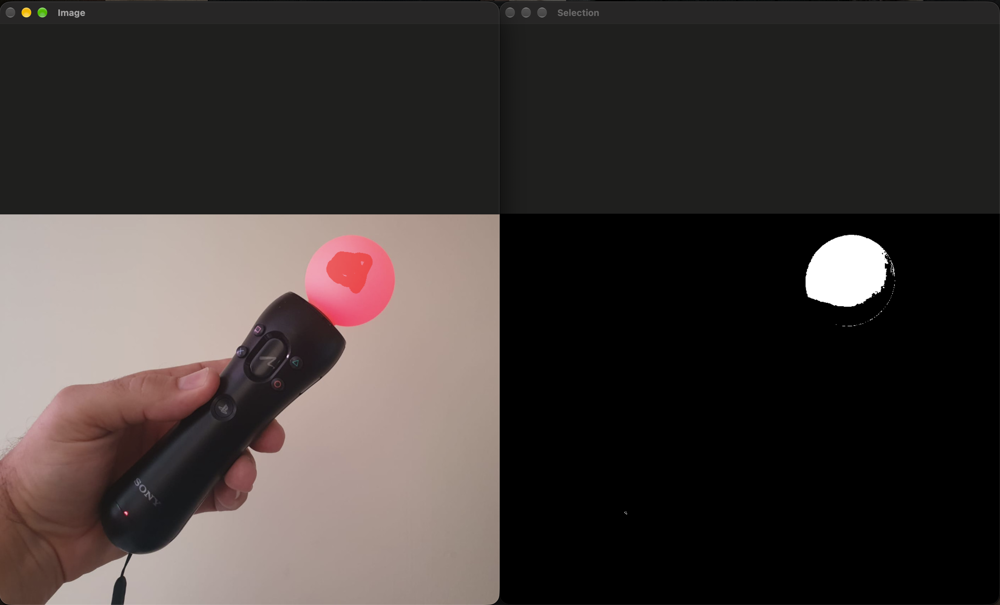

== Capítulo 10
Foi implementado um programa para recuperar uma imagem escondida por esteganografia, utilizando como referência o bitplanes.cpp. O programa recebe a imagem esteganografada como parâmetro, extrai os 3 bits menos significativos de cada canal dos pixels e os desloca para os bits mais significativos, gerando a imagem recuperada em um novo arquivo.

=== Exercício 1

```
[recupera.cpp]

#include <iostream>
#include <opencv2/opencv.hpp>

int main(int argc, char** argv) {

    if (argc != 2) {
        std::cout << "Uso: " << argv[0] << " <imagem_esteganografada>" << std::endl;
        return -1;
    }

    cv::Mat imagemEsteganografada;
    cv::Mat imagemRecuperada;

    int nbits = 3;

    imagemEsteganografada = cv::imread(argv[1], cv::IMREAD_COLOR);

    if (imagemEsteganografada.empty()) {
        std::cout << "Imagem nao carregou corretamente" << std::endl;
        return -1;
    }

    imagemRecuperada = cv::Mat::zeros(
        imagemEsteganografada.size(),
        imagemEsteganografada.type()
    );

    for (int i = 0; i < imagemEsteganografada.rows; i++) {
        for (int j = 0; j < imagemEsteganografada.cols; j++) {

            cv::Vec3b pixel = imagemEsteganografada.at<cv::Vec3b>(i, j);
            cv::Vec3b recuperado;

            // Pega os 3 bits menos significativos
            // e coloca nos 3 bits mais significativos.
            recuperado[0] = (pixel[0] & 0x07) << (8 - nbits);
            recuperado[1] = (pixel[1] & 0x07) << (8 - nbits);
            recuperado[2] = (pixel[2] & 0x07) << (8 - nbits);

            imagemRecuperada.at<cv::Vec3b>(i, j) = recuperado;
        }
    }

    cv::imwrite("imagem-recuperada.png", imagemRecuperada);

    std::cout << "Imagem recuperada salva como: imagem-recuperada.png"
              << std::endl;

    return 0;
}
```

.Exercício 10.1
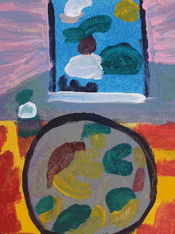

== Capítulo 11

=== Exercício 1
o problema ocorre quando o número de objetos ultrapassa 255, pois os rótulos armazenados em uma imagem CV_8U não conseguem representar valores maiores. Uma solução é utilizar uma estrutura de rótulos com maior profundidade, como CV_32S, usando connectedComponents() para realizar a rotulação.


```
[ex1.cpp]
#include <iostream>
#include <opencv2/opencv.hpp>

using namespace cv;
using namespace std;

int main(int argc, char** argv) {

    if (argc < 2) {
        cout << "Uso: " << argv[0] << " <imagem>" << endl;
        return -1;
    }

    // Carrega a imagem em tons de cinza
    Mat image = imread(argv[1], IMREAD_GRAYSCALE);

    if (!image.data) {
        cout << "Imagem nao carregou corretamente" << endl;
        return -1;
    }

    cout << image.cols << "x" << image.rows << endl;

    // Cria uma imagem binaria
    // Pixels brancos (255) representam os objetos
    Mat binary;

    threshold(image, binary, 127, 255, THRESH_BINARY);

    // Matriz para armazenar os rotulos
    // CV_32S permite valores muito maiores que 255
    Mat labels;

    // Rotula os componentes conexos
    int nobjects = connectedComponents(
        binary,
        labels,
        8,
        CV_32S
    );

    // O objeto 0 representa o fundo,
    // por isso o numero de objetos e nobjects - 1
    nobjects--;

    cout << "A figura tem "
         << nobjects
         << " bolhas" << endl;

    // Cria uma imagem para visualizacao
    Mat visualization;

    // Normaliza os rotulos para 0-255
    normalize(
        labels,
        visualization,
        0,
        255,
        NORM_MINMAX
    );

    visualization.convertTo(visualization, CV_8U);

    // Mostra a imagem rotulada
    imshow("Imagem rotulada", visualization);

    // Salva o resultado
    imwrite("labeling.png", visualization);

    waitKey();

    return 0;
}
```
.Exercício 11.1
image::labeling.png[Saída do Exercício 11.1]

Resultado: 
256x256
A figura tem 32 bolhas

=== Exercício 2
O algoritmo foi aprimorado para identificar objetos com e sem buracos internos, inclusive permitindo a existência de múltiplos buracos em um mesmo objeto. Além disso, objetos que tocam as bordas da imagem são desconsiderados da contagem. No teste realizado, foram encontrados 32 objetos na imagem, dos quais 21 não tocavam as bordas. Entre esses, 14 não possuíam buracos e 7 possuíam um buraco interno. Não foram encontrados objetos com mais de um buraco. Assim, o algoritmo conseguiu diferenciar corretamente as regiões com e sem buracos e ignorar os objetos que tocavam as bordas.

```
[ex2.cpp]
#include <iostream>
#include <opencv2/opencv.hpp>

using namespace cv;
using namespace std;

int main(int argc, char** argv) {

    if (argc < 2) {
        cout << "Uso: " << argv[0] << " <imagem>" << endl;
        return -1;
    }

    // Carrega a imagem
    Mat image = imread(argv[1], IMREAD_GRAYSCALE);

    if (image.empty()) {
        cout << "Imagem nao carregou corretamente" << endl;
        return -1;
    }

    cout << image.cols << "x" << image.rows << endl;

    // ============================================================
    // 1. Binarizacao
    // ============================================================

    Mat binary;

    threshold(image, binary, 127, 255, THRESH_BINARY);

    // ============================================================
    // 2. Rotulacao dos objetos
    // ============================================================

    Mat labels;

    int nobjects = connectedComponents(
        binary,
        labels,
        8,
        CV_32S
    );

    nobjects--;

    cout << "Objetos encontrados: "
         << nobjects << endl;

    // Contadores
    int validObjects = 0;
    int objectsWithHoles = 0;
    int objectsWithoutHoles = 0;
    int objectsWithMultipleHoles = 0;

    // ============================================================
    // 3. Analisa cada objeto
    // ============================================================

    for (int obj = 1; obj <= nobjects; obj++) {

        // --------------------------------------------------------
        // Verifica se o objeto toca a borda da imagem
        // --------------------------------------------------------

        bool touchesBorder = false;

        // Borda superior e inferior
        for (int x = 0; x < image.cols; x++) {

            if (labels.at<int>(0, x) == obj ||
                labels.at<int>(image.rows - 1, x) == obj) {

                touchesBorder = true;
                break;
            }
        }

        // Borda esquerda e direita
        if (!touchesBorder) {

            for (int y = 0; y < image.rows; y++) {

                if (labels.at<int>(y, 0) == obj ||
                    labels.at<int>(y, image.cols - 1) == obj) {

                    touchesBorder = true;
                    break;
                }
            }
        }

        // Se toca a borda, ignora
        if (touchesBorder) {
            continue;
        }

        validObjects++;

        // --------------------------------------------------------
        // Cria máscara do objeto
        // --------------------------------------------------------

        Mat objectMask = (labels == obj);

        // --------------------------------------------------------
        // Encontra os limites do objeto manualmente
        // --------------------------------------------------------

        int minX = image.cols;
        int maxX = 0;
        int minY = image.rows;
        int maxY = 0;

        for (int y = 0; y < image.rows; y++) {

            for (int x = 0; x < image.cols; x++) {

                if (labels.at<int>(y, x) == obj) {

                    if (x < minX) minX = x;
                    if (x > maxX) maxX = x;
                    if (y < minY) minY = y;
                    if (y > maxY) maxY = y;
                }
            }
        }

        // --------------------------------------------------------
        // Cria uma região somente com o objeto
        // --------------------------------------------------------

        Rect roiRect(
            minX,
            minY,
            maxX - minX + 1,
            maxY - minY + 1
        );

        Mat roi = objectMask(roiRect);

        // --------------------------------------------------------
        // Inverte a imagem
        //
        // Objeto = preto
        // Fundo/buracos = branco
        // --------------------------------------------------------

        Mat inverted;

        bitwise_not(roi, inverted);

        // --------------------------------------------------------
        // Rotula as regiões brancas
        // --------------------------------------------------------

        Mat holeLabels;

        int nregions = connectedComponents(
            inverted,
            holeLabels,
            8,
            CV_32S
        );

        int holes = 0;

        // --------------------------------------------------------
        // Procura regiões que NÃO tocam a borda da ROI
        //
        // Uma região branca que toca a borda é o fundo externo.
        // Uma região branca fechada é um buraco.
        // --------------------------------------------------------

        for (int region = 1; region < nregions; region++) {

            bool touchesRoiBorder = false;

            // Borda superior/inferior da ROI
            for (int x = 0; x < holeLabels.cols; x++) {

                if (holeLabels.at<int>(0, x) == region ||
                    holeLabels.at<int>(holeLabels.rows - 1, x) == region) {

                    touchesRoiBorder = true;
                    break;
                }
            }

            // Borda esquerda/direita da ROI
            if (!touchesRoiBorder) {

                for (int y = 0; y < holeLabels.rows; y++) {

                    if (holeLabels.at<int>(y, 0) == region ||
                        holeLabels.at<int>(y, holeLabels.cols - 1) == region) {

                        touchesRoiBorder = true;
                        break;
                    }
                }
            }

            // Se não toca a borda, é um buraco
            if (!touchesRoiBorder) {
                holes++;
            }
        }

        // --------------------------------------------------------
        // Classificação do objeto
        // --------------------------------------------------------

        if (holes == 0) {

            objectsWithoutHoles++;

            cout << "Objeto " << obj
                 << ": sem buracos" << endl;

        } else {

            objectsWithHoles++;

            cout << "Objeto " << obj
                 << ": " << holes
                 << " buraco(s)" << endl;

            if (holes > 1) {
                objectsWithMultipleHoles++;
            }
        }
    }

    // ============================================================
    // 4. Resultado
    // ============================================================

    cout << endl;
    cout << "========== RESULTADO ==========" << endl;

    cout << "Objetos validos: "
         << validObjects << endl;

    cout << "Objetos sem buracos: "
         << objectsWithoutHoles << endl;

    cout << "Objetos com buracos: "
         << objectsWithHoles << endl;

    cout << "Objetos com mais de um buraco: "
         << objectsWithMultipleHoles << endl;

    // ============================================================
    // 5. Visualizacao
    // ============================================================

    Mat visualization;

    normalize(
        labels,
        visualization,
        0,
        255,
        NORM_MINMAX
    );

    visualization.convertTo(visualization, CV_8U);

    imshow("Objetos rotulados", visualization);

    imwrite("labeling_holes.png", visualization);

    waitKey();

    return 0;
}
```

.Exercício 11.2
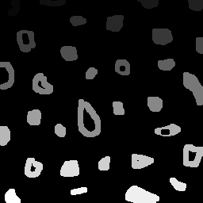

Resultado: 
Objetos encontrados: 32
Objetos válidos: 21
Objetos sem buracos: 14
Objetos com buracos: 7
Objetos com mais de um buraco: 0

== Capítulo 12

=== Exercício 1

Foi implementado o programa equalize.cpp, que captura imagens da câmera, converte cada quadro para tons de cinza e aplica a equalização do histograma com cv::equalizeHist(), permitindo observar a melhoria do contraste em diferentes condições de iluminação.

```
[equalize.cpp]
#include <iostream>
#include <opencv2/opencv.hpp>
#include "camera.hpp"

int main(int argc, char** argv) {

    cv::Mat image;
    cv::Mat gray;
    cv::Mat equalized;

    int width, height;
    int camera;
    int key;

    cv::VideoCapture cap;

    // Seleciona a câmera disponível
    camera = cameraEnumerator();
    cap.open(camera);

    if (!cap.isOpened()) {
        std::cout << "Cameras indisponiveis" << std::endl;
        return -1;
    }

    // Define a resolução
    cap.set(cv::CAP_PROP_FRAME_WIDTH, 640);
    cap.set(cv::CAP_PROP_FRAME_HEIGHT, 480);

    width = cap.get(cv::CAP_PROP_FRAME_WIDTH);
    height = cap.get(cv::CAP_PROP_FRAME_HEIGHT);

    std::cout << "largura = " << width << std::endl;
    std::cout << "altura  = " << height << std::endl;

    while (1) {

        // Captura um quadro
        cap >> image;

        if (image.empty()) {
            std::cout << "Erro ao capturar imagem." << std::endl;
            break;
        }

        // Converte para tons de cinza
        cv::cvtColor(image, gray, cv::COLOR_BGR2GRAY);

        // Equaliza o histograma
        cv::equalizeHist(gray, equalized);

        // Exibe a imagem equalizada
        cv::imshow("Imagem Equalizada", equalized);

        // ESC encerra
        key = cv::waitKey(30);

        if (key == 27)
            break;
    }

    cap.release();
    cv::destroyAllWindows();

    return 0;
}
```

.Exercício 12.1
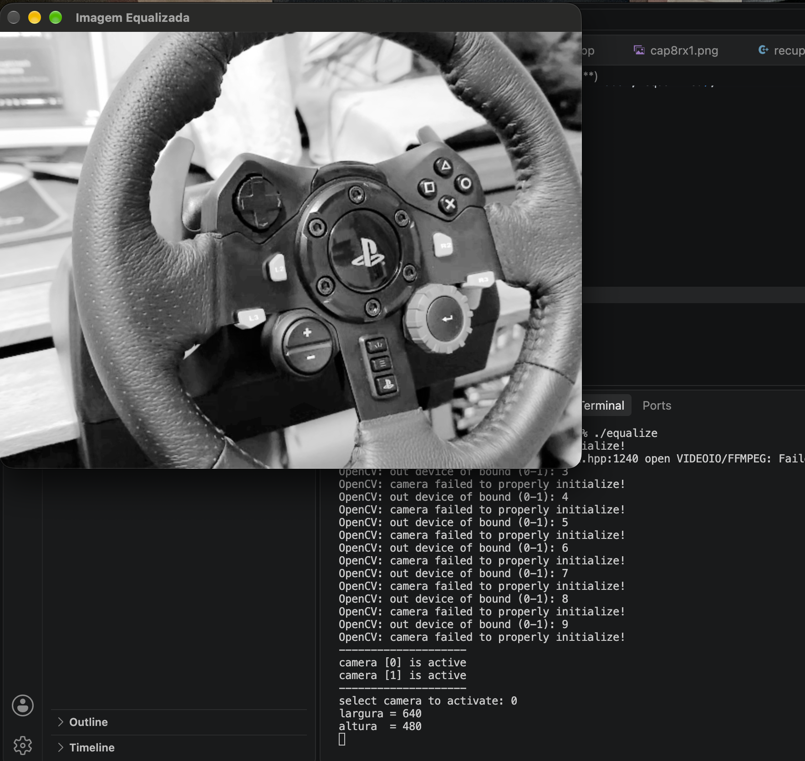

=== Exercício 2
Foi implementado o programa motiondetector.cpp, que calcula continuamente o histograma em tons de cinza de cada quadro, compara o histograma atual com o anterior utilizando a distância de Bhattacharyya e ativa um alarme visual quando a diferença ultrapassa um limiar pré-estabelecido.


```
[motiondetector.cpp]
#include <iostream>
#include <opencv2/opencv.hpp>

int main(int argc, char** argv) {

    cv::Mat image;
    cv::Mat gray;

    cv::Mat histAtual;
    cv::Mat histAnterior;

    // Número de bins do histograma
    int nbins = 64;

    float range[] = {0, 256};
    const float* histrange = {range};

    bool uniform = true;
    bool accumulate = false;

    // Limiar para ativar o alarme
    double limiar = 0.30;

    // Abre a câmera
    cv::VideoCapture cap(0);

    if (!cap.isOpened()) {
        std::cout << "Nao foi possivel abrir a camera." << std::endl;
        return -1;
    }

    // Define a resolução
    cap.set(cv::CAP_PROP_FRAME_WIDTH, 640);
    cap.set(cv::CAP_PROP_FRAME_HEIGHT, 480);

    std::cout << "Detector de movimento iniciado." << std::endl;
    std::cout << "Limiar = " << limiar << std::endl;
    std::cout << "Pressione ESC para sair." << std::endl;

    bool primeiroFrame = true;

    while (true) {

        // Captura o frame
        cap >> image;

        if (image.empty()) {
            std::cout << "Erro ao capturar imagem." << std::endl;
            break;
        }

        // Converte para tons de cinza
        cv::cvtColor(image, gray, cv::COLOR_BGR2GRAY);

        // Calcula o histograma do frame atual
        cv::calcHist(
            &gray,
            1,
            0,
            cv::Mat(),
            histAtual,
            1,
            &nbins,
            &histrange,
            uniform,
            accumulate
        );

        // Normaliza o histograma
        cv::normalize(
            histAtual,
            histAtual,
            0,
            1,
            cv::NORM_MINMAX
        );

        // No primeiro frame não existe histograma anterior
        if (primeiroFrame) {

            histAtual.copyTo(histAnterior);
            primeiroFrame = false;

            cv::putText(
                image,
                "Inicializando...",
                cv::Point(20, 40),
                cv::FONT_HERSHEY_SIMPLEX,
                1.0,
                cv::Scalar(0, 255, 255),
                2
            );

        } else {

            // Compara o histograma atual com o anterior
            double diferenca = cv::compareHist(
                histAtual,
                histAnterior,
                cv::HISTCMP_BHATTACHARYYA
            );

            std::cout << "Diferenca: " << diferenca;

            // Verifica se ultrapassou o limiar
            if (diferenca > limiar) {

                std::cout << " -> MOVIMENTO DETECTADO!" << std::endl;

                // Alarme visual
                cv::putText(
                    image,
                    "!!! MOVIMENTO DETECTADO !!!",
                    cv::Point(20, 40),
                    cv::FONT_HERSHEY_SIMPLEX,
                    1.0,
                    cv::Scalar(0, 0, 255),
                    3
                );

                // Borda vermelha na imagem
                cv::rectangle(
                    image,
                    cv::Point(0, 0),
                    cv::Point(image.cols - 1, image.rows - 1),
                    cv::Scalar(0, 0, 255),
                    10
                );

            } else {

                std::cout << " -> Sem movimento" << std::endl;

                cv::putText(
                    image,
                    "Sem movimento",
                    cv::Point(20, 40),
                    cv::FONT_HERSHEY_SIMPLEX,
                    1.0,
                    cv::Scalar(0, 255, 0),
                    2
                );
            }

            // O histograma atual passa a ser o anterior
            histAtual.copyTo(histAnterior);
        }

        // Mostra a imagem
        cv::imshow("Motion Detector", image);

        // ESC para sair
        int key = cv::waitKey(30);

        if (key == 27)
            break;
    }

    cap.release();
    cv::destroyAllWindows();

    return 0;
}
```

.Exercício 12.2
image::cap12ex2cmovs.png[Saída do Exercício 12.2]

.Exercício 12.2
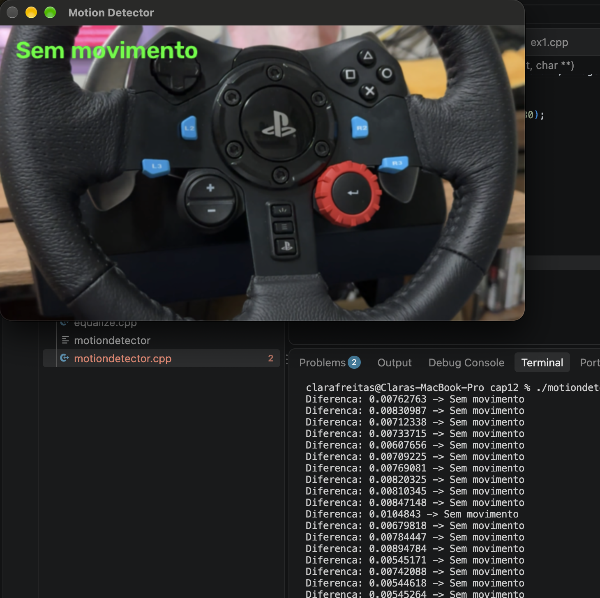

== Capítulo 13

=== Exercício 1
O programa registro.cpp foi modificado para permitir a seleção interativa dos quatro pontos utilizados na correção de perspectiva. A seleção é realizada através de cliques do botão esquerdo do mouse sobre a imagem, seguindo a ordem: canto superior esquerdo, superior direito, inferior direito e inferior esquerdo. Após a seleção dos pontos, suas coordenadas são utilizadas para calcular a transformação projetiva, que é aplicada à imagem através da função warpPerspective(). A largura e a altura da imagem resultante também são determinadas automaticamente a partir das distâncias entre os pontos selecionados.


```
[registro.cpp]
#include <opencv2/opencv.hpp>
#include <iostream>
#include <vector>

std::vector<cv::Point2f> pontos;

// Callback do mouse
void mouseCallback(int event, int x, int y, int flags, void* userdata)
{
    if (event == cv::EVENT_LBUTTONDOWN && pontos.size() < 4)
    {
        pontos.push_back(cv::Point2f(x, y));

        std::cout << "Ponto " << pontos.size()
                  << ": (" << x << ", " << y << ")" << std::endl;

        cv::Mat* imagem = static_cast<cv::Mat*>(userdata);

        // Desenha o ponto
        cv::circle(
            *imagem,
            cv::Point(x, y),
            5,
            cv::Scalar(0, 0, 255),
            -1
        );

        // Número do ponto
        cv::putText(
            *imagem,
            std::to_string(pontos.size()),
            cv::Point(x + 10, y),
            cv::FONT_HERSHEY_SIMPLEX,
            0.7,
            cv::Scalar(0, 255, 0),
            2
        );

        cv::imshow("Selecione os pontos", *imagem);
    }
}

int main()
{
    // Carrega a imagem
    cv::Mat image = cv::imread("voltimetro.png");

    if (image.empty())
    {
        std::cerr << "Erro ao carregar orca.jpg" << std::endl;
        return -1;
    }

    cv::Mat imagemSelecao = image.clone();

    std::cout << "Selecione os quatro pontos na imagem.\n";
    std::cout << "Ordem:\n";
    std::cout << "1 - Superior esquerdo\n";
    std::cout << "2 - Superior direito\n";
    std::cout << "3 - Inferior direito\n";
    std::cout << "4 - Inferior esquerdo\n\n";

    cv::namedWindow("Selecione os pontos");

    cv::setMouseCallback(
        "Selecione os pontos",
        mouseCallback,
        &imagemSelecao
    );

    cv::imshow("Selecione os pontos", imagemSelecao);

    // Aguarda os quatro cliques
    while (pontos.size() < 4)
    {
        int tecla = cv::waitKey(30);

        if (tecla == 27)
        {
            std::cout << "Operacao cancelada." << std::endl;
            return 0;
        }
    }

    std::cout << "\nQuatro pontos selecionados!\n";

    // Calcula largura
    int largura = std::max(
        (int)cv::norm(pontos[0] - pontos[1]),
        (int)cv::norm(pontos[2] - pontos[3])
    );

    // Calcula altura
    int altura = std::max(
        (int)cv::norm(pontos[1] - pontos[2]),
        (int)cv::norm(pontos[3] - pontos[0])
    );

    std::cout << "Largura: " << largura << std::endl;
    std::cout << "Altura: " << altura << std::endl;

    /*
     * Pontos de destino
     *
     * 0 ---------------- 1
     * |                  |
     * |                  |
     * 3 ---------------- 2
     */
    std::vector<cv::Point2f> destino;

    destino.push_back(cv::Point2f(0, 0));
    destino.push_back(cv::Point2f(largura - 1, 0));
    destino.push_back(cv::Point2f(largura - 1, altura - 1));
    destino.push_back(cv::Point2f(0, altura - 1));

    /*
     * Monta o sistema para calcular a homografia.
     *
     * Para cada ponto:
     *
     * x' = (h11*x + h12*y + h13) /
     *      (h31*x + h32*y + 1)
     *
     * y' = (h21*x + h22*y + h23) /
     *      (h31*x + h32*y + 1)
     */

    cv::Mat A(8, 8, CV_64F);
    cv::Mat B(8, 1, CV_64F);

    for (int i = 0; i < 4; i++)
    {
        double x = pontos[i].x;
        double y = pontos[i].y;

        double xp = destino[i].x;
        double yp = destino[i].y;

        int linha = 2 * i;

        // Equação para x'
        A.at<double>(linha, 0) = x;
        A.at<double>(linha, 1) = y;
        A.at<double>(linha, 2) = 1;
        A.at<double>(linha, 3) = 0;
        A.at<double>(linha, 4) = 0;
        A.at<double>(linha, 5) = 0;
        A.at<double>(linha, 6) = -x * xp;
        A.at<double>(linha, 7) = -y * xp;

        B.at<double>(linha, 0) = xp;

        // Equação para y'
        A.at<double>(linha + 1, 0) = 0;
        A.at<double>(linha + 1, 1) = 0;
        A.at<double>(linha + 1, 2) = 0;
        A.at<double>(linha + 1, 3) = x;
        A.at<double>(linha + 1, 4) = y;
        A.at<double>(linha + 1, 5) = 1;
        A.at<double>(linha + 1, 6) = -x * yp;
        A.at<double>(linha + 1, 7) = -y * yp;

        B.at<double>(linha + 1, 0) = yp;
    }

    // Resolve o sistema
    cv::Mat h;

    cv::solve(
        A,
        B,
        h,
        cv::DECOMP_LU
    );

    // Monta a matriz de perspectiva
    cv::Mat perspectiveMatrix = cv::Mat::eye(3, 3, CV_64F);

    perspectiveMatrix.at<double>(0, 0) = h.at<double>(0);
    perspectiveMatrix.at<double>(0, 1) = h.at<double>(1);
    perspectiveMatrix.at<double>(0, 2) = h.at<double>(2);

    perspectiveMatrix.at<double>(1, 0) = h.at<double>(3);
    perspectiveMatrix.at<double>(1, 1) = h.at<double>(4);
    perspectiveMatrix.at<double>(1, 2) = h.at<double>(5);

    perspectiveMatrix.at<double>(2, 0) = h.at<double>(6);
    perspectiveMatrix.at<double>(2, 1) = h.at<double>(7);

    std::cout << "\nMatriz de perspectiva:\n";
    std::cout << perspectiveMatrix << std::endl;

    // Corrige a perspectiva
    cv::Mat correctedImage;

    cv::warpPerspective(
        image,
        correctedImage,
        perspectiveMatrix,
        cv::Size(largura, altura)
    );

    // Mostra resultado
    cv::imshow("Original Image", image);
    cv::imshow("Corrected Image", correctedImage);

    cv::waitKey(0);

    return 0;
}

```

.Exercício 13.1
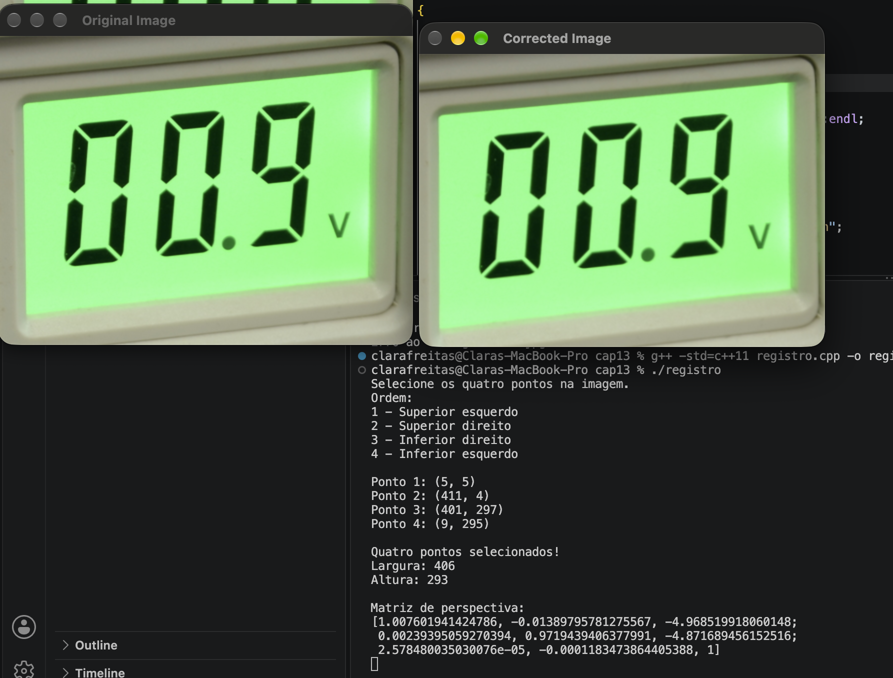

== Capítulo 14

=== Exercício 1
Foi implementado o programa convolucao2.cpp, que aplica o filtro da média utilizando máscaras de diferentes tamanhos e compara os resultados, observando que máscaras maiores produzem maior suavização e desfoque da imagem.

```
[convolucao2.cpp]
#include <iostream>
#include <opencv2/opencv.hpp>
#include "camera.hpp"

void printmask(cv::Mat &m) {
    for (int i = 0; i < m.rows; i++) {
        for (int j = 0; j < m.cols; j++) {
            std::cout << m.at<float>(i, j) << " ";
        }
        std::cout << std::endl;
    }
}

// Cria uma máscara do filtro da média de tamanho n x n
cv::Mat criaMascaraMedia(int n) {
    cv::Mat mask(n, n, CV_32F);

    float valor = 1.0f / (n * n);

    for (int i = 0; i < n; i++) {
        for (int j = 0; j < n; j++) {
            mask.at<float>(i, j) = valor;
        }
    }

    return mask;
}

int main(int argc, char **argv) {

    cv::VideoCapture cap;
    int camera;

    // Tamanhos das máscaras que serão comparados
    int tamanho1 = 3;
    int tamanho2 = 5;

    // Permite informar os tamanhos pela linha de comando
    if (argc == 3) {
        tamanho1 = atoi(argv[1]);
        tamanho2 = atoi(argv[2]);
    }

    // Os tamanhos precisam ser ímpares
    if (tamanho1 % 2 == 0 || tamanho2 % 2 == 0) {
        std::cerr << "Os tamanhos das mascaras devem ser impares." << std::endl;
        return -1;
    }

    cv::Mat frame;
    cv::Mat framegray;
    cv::Mat frame32f;

    cv::Mat mask1;
    cv::Mat mask2;

    cv::Mat result1;
    cv::Mat result2;

    cv::Mat filtered1;
    cv::Mat filtered2;

    char key;

    // Cria as máscaras
    mask1 = criaMascaraMedia(tamanho1);
    mask2 = criaMascaraMedia(tamanho2);

    std::cout << "\nMascara " << tamanho1 << "x" << tamanho1 << ":\n";
    printmask(mask1);

    std::cout << "\nMascara " << tamanho2 << "x" << tamanho2 << ":\n";
    printmask(mask2);

    // Inicializa a câmera
    camera = cameraEnumerator();
    cap.open(camera);

    if (!cap.isOpened()) {
        std::cerr << "Erro ao abrir a camera." << std::endl;
        return -1;
    }

    cap.set(cv::CAP_PROP_FRAME_WIDTH, 640);
    cap.set(cv::CAP_PROP_FRAME_HEIGHT, 480);

    cv::namedWindow("original", cv::WINDOW_NORMAL);
    cv::namedWindow("media " + std::to_string(tamanho1) + "x" +
                    std::to_string(tamanho1), cv::WINDOW_NORMAL);
    cv::namedWindow("media " + std::to_string(tamanho2) + "x" +
                    std::to_string(tamanho2), cv::WINDOW_NORMAL);

    for (;;) {

        // Captura uma imagem
        cap >> frame;

        if (frame.empty())
            break;

        // Converte para tons de cinza
        cv::cvtColor(frame, framegray, cv::COLOR_BGR2GRAY);

        // Espelha a imagem
        cv::flip(framegray, framegray, 1);

        cv::imshow("original", framegray);

        // Converte para float
        framegray.convertTo(frame32f, CV_32F);

        // Convolução com a primeira máscara
        cv::filter2D(
            frame32f,
            filtered1,
            frame32f.depth(),
            mask1,
            cv::Point(tamanho1 / 2, tamanho1 / 2),
            cv::BORDER_REPLICATE
        );

        // Convolução com a segunda máscara
        cv::filter2D(
            frame32f,
            filtered2,
            frame32f.depth(),
            mask2,
            cv::Point(tamanho2 / 2, tamanho2 / 2),
            cv::BORDER_REPLICATE
        );

        // Converte para 8 bits para exibição
        filtered1.convertTo(result1, CV_8U);
        filtered2.convertTo(result2, CV_8U);

        // Mostra os resultados
        cv::imshow(
            "media " + std::to_string(tamanho1) + "x" +
            std::to_string(tamanho1),
            result1
        );

        cv::imshow(
            "media " + std::to_string(tamanho2) + "x" +
            std::to_string(tamanho2),
            result2
        );

        // ESC encerra
        key = (char)cv::waitKey(10);

        if (key == 27)
            break;
    }

    return 0;
}
```

.Exercício 14.1
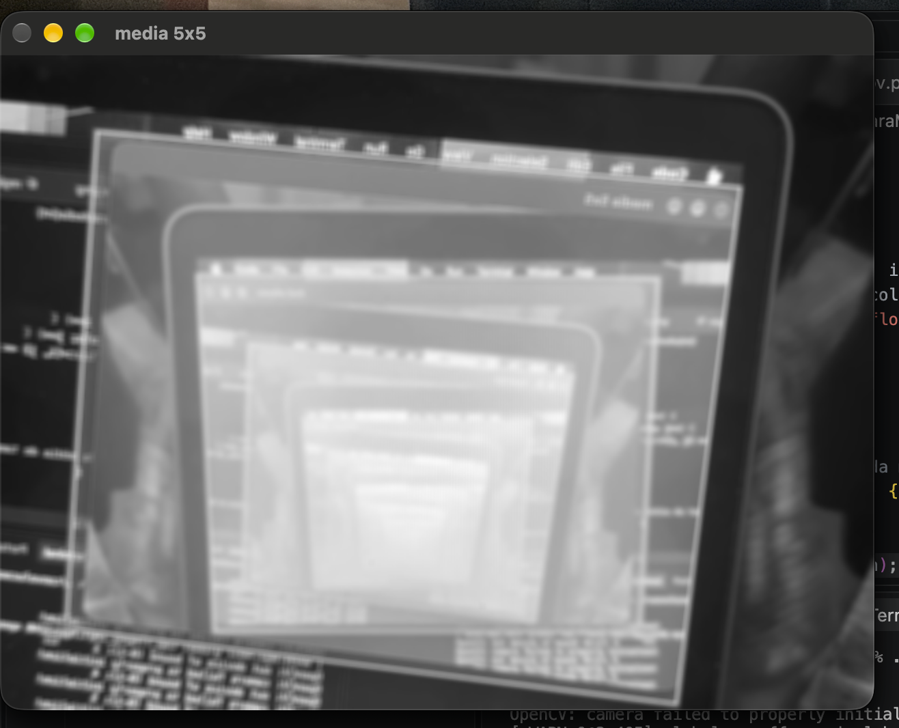

=== Exercício 2
Foi implementado o programa depthoffield.cpp, que utiliza o filtro Laplaciano para identificar as regiões mais nítidas de diferentes frames e combina os pixels correspondentes em uma única imagem, aumentando a quantidade de elementos em foco na cena.

```
[depthoffield.cpp]
#include <iostream>
#include <opencv2/opencv.hpp>
#include "camera.hpp"

int main(int argc, char **argv) {

    cv::VideoCapture cap;
    int camera;

    // Matriz usada para guardar o maior valor do Laplaciano
    cv::Mat maxLaplacian;

    // Imagens
    cv::Mat frame;
    cv::Mat frameGray;
    cv::Mat frame32f;
    cv::Mat laplacian;
    cv::Mat output;

    // Máscara Laplaciana 3x3
    float lapMaskData[] = {
         0, -1,  0,
        -1,  4, -1,
         0, -1,  0
    };

    cv::Mat lapMask(3, 3, CV_32F, lapMaskData);

    // ---------------------------------------------------------
    // Abre vídeo passado como argumento ou utiliza a câmera
    // ---------------------------------------------------------

    if (argc > 1) {
        cap.open(argv[1]);
    } else {
        camera = cameraEnumerator();
        cap.open(camera);
    }

    if (!cap.isOpened()) {
        std::cerr << "Erro ao abrir a câmera/vídeo." << std::endl;
        return -1;
    }

    // Tamanho desejado para a captura
    cap.set(cv::CAP_PROP_FRAME_WIDTH, 640);
    cap.set(cv::CAP_PROP_FRAME_HEIGHT, 480);

    cv::namedWindow("Original", cv::WINDOW_NORMAL);
    cv::namedWindow("Resultado", cv::WINDOW_NORMAL);
    cv::namedWindow("Laplaciano", cv::WINDOW_NORMAL);

    bool primeiroFrame = true;

    while (true) {

        // ---------------------------------------------------------
        // 1. Captura um frame
        // ---------------------------------------------------------

        cap >> frame;

        if (frame.empty())
            break;

        // Se estiver usando câmera, espelha a imagem
        if (argc == 1)
            cv::flip(frame, frame, 1);

        // ---------------------------------------------------------
        // 2. Converte para tons de cinza
        // ---------------------------------------------------------

        cv::cvtColor(frame, frameGray, cv::COLOR_BGR2GRAY);

        // ---------------------------------------------------------
        // 3. Cria a matriz para guardar os máximos
        // ---------------------------------------------------------

        if (primeiroFrame) {
            maxLaplacian = cv::Mat::zeros(
                frameGray.size(),
                CV_32F
            );

            output = frame.clone();

            primeiroFrame = false;
        }

        // ---------------------------------------------------------
        // 4. Aplica o filtro Laplaciano
        // ---------------------------------------------------------

        frameGray.convertTo(frame32f, CV_32F);

        cv::filter2D(
            frame32f,
            laplacian,
            CV_32F,
            lapMask,
            cv::Point(1, 1),
            cv::BORDER_REPLICATE
        );

        // Utilizamos o valor absoluto como medida de nitidez
        cv::Mat laplacianAbs = cv::abs(laplacian);

        // ---------------------------------------------------------
        // 5. Compara com os máximos anteriores
        // ---------------------------------------------------------

        for (int y = 0; y < frame.rows; y++) {

            for (int x = 0; x < frame.cols; x++) {

                float atual = laplacianAbs.at<float>(y, x);
                float maximo = maxLaplacian.at<float>(y, x);

                // Se o pixel atual estiver mais nítido,
                // guarda o novo máximo e o pixel colorido
                if (atual > maximo) {

                    maxLaplacian.at<float>(y, x) = atual;

                    output.at<cv::Vec3b>(y, x) =
                        frame.at<cv::Vec3b>(y, x);
                }
            }
        }

        // ---------------------------------------------------------
        // 6. Exibe a imagem de saída
        // ---------------------------------------------------------

        cv::imshow("Original", frame);

        // Normaliza o Laplaciano para visualização
        cv::Mat laplacianDisplay;
        cv::normalize(
            laplacianAbs,
            laplacianDisplay,
            0,
            255,
            cv::NORM_MINMAX,
            CV_8U
        );

        cv::imshow("Laplaciano", laplacianDisplay);
        cv::imshow("Resultado", output);

        char key = (char)cv::waitKey(10);

        // ESC encerra
        if (key == 27)
            break;

        // 'r' reinicia os máximos
        if (key == 'r') {

            maxLaplacian = cv::Mat::zeros(
                frameGray.size(),
                CV_32F
            );

            output = frame.clone();

            std::cout << "Maximos reiniciados." << std::endl;
        }
    }

    cap.release();
    cv::destroyAllWindows();

    return 0;
}
```

.Exercício 14.2
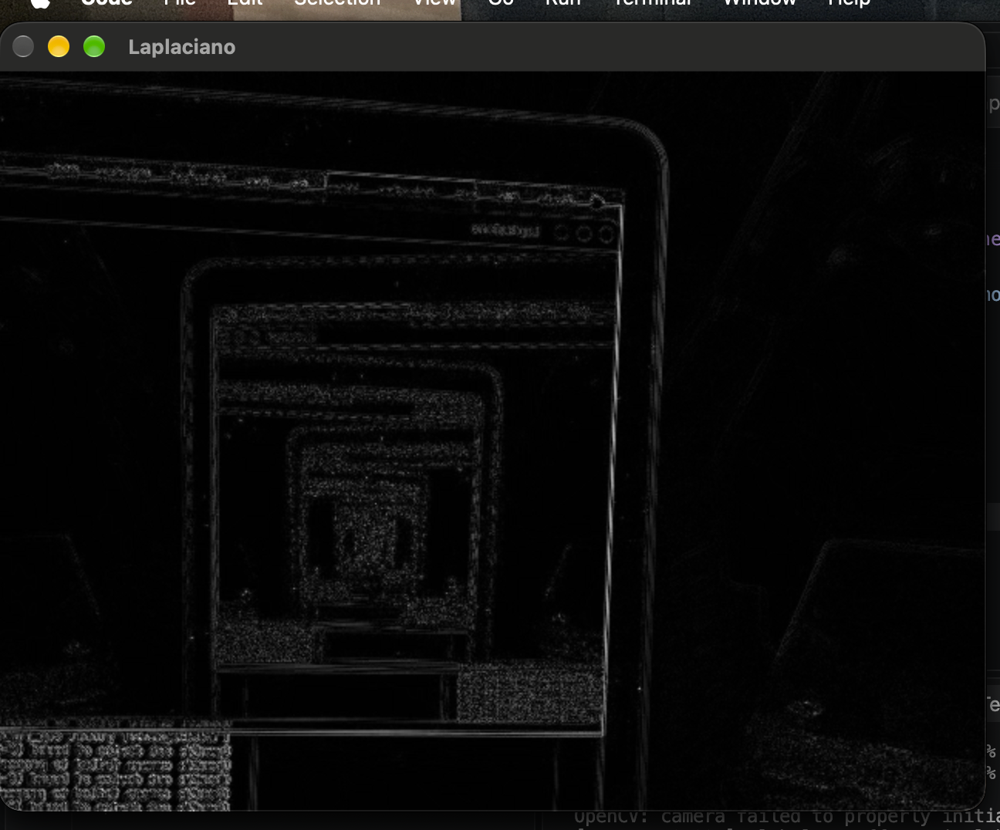

.Exercício 14.2
image::cap14ex2_vasos.png.png[Saída do Exercício 14.2]


== Capítulo 15

=== Exercício 1
Tilt-shift em imagem: Foi implementado um programa para aplicar o efeito tilt-shift em uma imagem, utilizando desfoque gaussiano e uma máscara de transição para manter uma região central em foco. Foram adicionados controles para ajustar a altura, a intensidade do desfoque e a posição vertical da região em foco, permitindo gerar e salvar a imagem resultante.

```
[tiltshift.cpp]
#include <iostream>
#include <opencv2/opencv.hpp>

using namespace cv;
using namespace std;

// Imagem original e imagem resultante
Mat original;
Mat resultado;

// Parâmetros dos trackbars
int foco_altura = 30;       // altura da região em foco (%)
int desfoque = 50;          // força do desfoque (%)
int foco_posicao = 50;      // posição vertical do centro (%)

int foco_altura_max = 100;
int desfoque_max = 100;
int foco_posicao_max = 100;

// Função que aplica o efeito tilt-shift
void aplicaTiltShift()
{
    if (original.empty())
        return;

    int largura = original.cols;
    int altura = original.rows;

    // ---------------------------------------------------------
    // 1. Cria uma versão borrada da imagem
    // ---------------------------------------------------------

    // O tamanho do kernel depende do controle de desfoque
    int ksize = 1 + 2 * (desfoque * 15 / desfoque_max);

    if (ksize < 1)
        ksize = 1;

    if (ksize % 2 == 0)
        ksize++;

    Mat borrada;

    GaussianBlur(
        original,
        borrada,
        Size(ksize, ksize),
        0
    );

    // ---------------------------------------------------------
    // 2. Define a posição e altura da região em foco
    // ---------------------------------------------------------

    double centro =
        (double)foco_posicao / foco_posicao_max * altura;

    double meia_altura =
        ((double)foco_altura / foco_altura_max * altura) / 2.0;

    // ---------------------------------------------------------
    // 3. Cria máscara com transição suave
    // ---------------------------------------------------------

    Mat mascara(altura, largura, CV_32FC1);

    for (int y = 0; y < altura; y++)
    {
        double distancia = abs(y - centro);

        double valor;

        if (distancia <= meia_altura)
        {
            // Região totalmente em foco
            valor = 1.0;
        }
        else
        {
            // Distância a partir do limite da região em foco
            double distanciaFora = distancia - meia_altura;

            // Quanto maior o desfoque, mais rápida é a transição
            double faixaTransicao =
                altura * (0.05 + 0.45 * (desfoque / 100.0));

            if (faixaTransicao < 1.0)
                faixaTransicao = 1.0;

            valor = 1.0 - distanciaFora / faixaTransicao;

            if (valor < 0.0)
                valor = 0.0;
        }

        for (int x = 0; x < largura; x++)
            mascara.at<float>(y, x) = (float)valor;
    }

    // ---------------------------------------------------------
    // 4. Combina imagem original e imagem borrada
    // ---------------------------------------------------------

    resultado = Mat::zeros(original.size(), original.type());

    for (int y = 0; y < altura; y++)
    {
        for (int x = 0; x < largura; x++)
        {
            float peso = mascara.at<float>(y, x);

            Vec3b pixelOriginal = original.at<Vec3b>(y, x);
            Vec3b pixelBorrado = borrada.at<Vec3b>(y, x);

            Vec3b &pixelResultado = resultado.at<Vec3b>(y, x);

            for (int c = 0; c < 3; c++)
            {
                pixelResultado[c] =
                    saturate_cast<uchar>(
                        peso * pixelOriginal[c] +
                        (1.0f - peso) * pixelBorrado[c]
                    );
            }
        }
    }

    // Mostra o resultado
    imshow("Tilt-Shift", resultado);
}

// Callbacks dos trackbars
void onFocoAltura(int, void*)
{
    aplicaTiltShift();
}

void onDesfoque(int, void*)
{
    aplicaTiltShift();
}

void onFocoPosicao(int, void*)
{
    aplicaTiltShift();
}

int main(int argc, char **argv)
{
    if (argc < 2)
    {
        cout << "Uso: " << argv[0] << " imagem" << endl;
        return 1;
    }

    // Carrega a imagem
    original = imread(argv[1]);

    if (original.empty())
    {
        cerr << "Erro ao abrir a imagem: "
             << argv[1] << endl;
        return 1;
    }

    // Cria janela
    namedWindow("Tilt-Shift", WINDOW_AUTOSIZE);

    // Cria os três controles
    createTrackbar(
        "Altura do foco",
        "Tilt-Shift",
        &foco_altura,
        foco_altura_max,
        onFocoAltura
    );

    createTrackbar(
        "Forca do desfoque",
        "Tilt-Shift",
        &desfoque,
        desfoque_max,
        onDesfoque
    );

    createTrackbar(
        "Posicao do foco",
        "Tilt-Shift",
        &foco_posicao,
        foco_posicao_max,
        onFocoPosicao
    );

    // Aplica o efeito inicialmente
    aplicaTiltShift();

    cout << endl;
    cout << "Controles:" << endl;
    cout << " - Altura do foco: tamanho da regiao nitida" << endl;
    cout << " - Forca do desfoque: intensidade do borramento" << endl;
    cout << " - Posicao do foco: deslocamento vertical da regiao" << endl;
    cout << endl;
    cout << "Pressione 's' para salvar a imagem." << endl;
    cout << "Pressione ESC para sair." << endl;

    while (true)
    {
        char tecla = waitKey(30);

        // Salvar resultado
        if (tecla == 's' || tecla == 'S')
        {
            imwrite("tiltshift_resultado.png", resultado);

            cout << "Imagem salva em: "
                 << "tiltshift_resultado.png"
                 << endl;
        }

        // Sair
        if (tecla == 27)
            break;
    }

    destroyAllWindows();

    return 0;
}
```

.Exercício 15.1
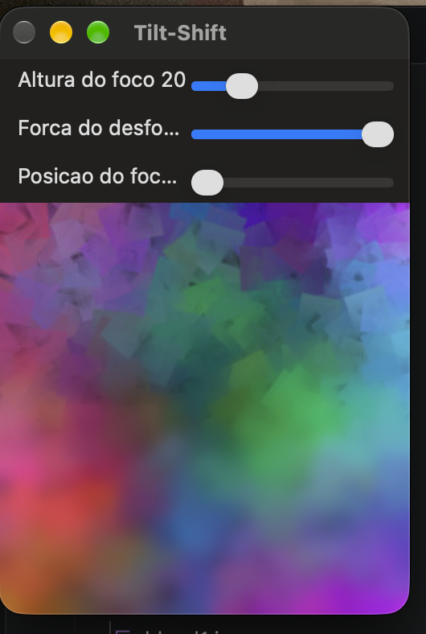


=== Exercício 2
```
[video.cpp]
#include <iostream>
#include <opencv2/opencv.hpp>

using namespace cv;
using namespace std;

// Parâmetros do efeito
int foco_altura = 30;
int forca_desfoque = 50;
int foco_posicao = 50;

// Função que aplica o efeito tilt-shift em um quadro
Mat aplicaTiltShift(const Mat &original)
{
    int largura = original.cols;
    int altura = original.rows;

    // ---------------------------------------------------------
    // Cria a imagem borrada
    // ---------------------------------------------------------

    int ksize = 1 + 2 * (forca_desfoque * 15 / 100);

    if (ksize < 1)
        ksize = 1;

    if (ksize % 2 == 0)
        ksize++;

    Mat borrada;

    GaussianBlur(
        original,
        borrada,
        Size(ksize, ksize),
        0
    );

    // ---------------------------------------------------------
    // Define a posição e a altura da região em foco
    // ---------------------------------------------------------

    double centro =
        (double)foco_posicao / 100.0 * altura;

    double meia_altura =
        ((double)foco_altura / 100.0 * altura) / 2.0;

    // ---------------------------------------------------------
    // Cria a máscara vertical
    // ---------------------------------------------------------

    Mat mascara(altura, largura, CV_32FC1);

    double faixa_transicao =
        altura * (0.05 + 0.45 * (forca_desfoque / 100.0));

    if (faixa_transicao < 1.0)
        faixa_transicao = 1.0;

    for (int y = 0; y < altura; y++)
    {
        double distancia = abs(y - centro);

        double peso;

        // Região completamente em foco
        if (distancia <= meia_altura)
        {
            peso = 1.0;
        }
        else
        {
            double distancia_fora =
                distancia - meia_altura;

            peso =
                1.0 - distancia_fora / faixa_transicao;

            if (peso < 0.0)
                peso = 0.0;
        }

        for (int x = 0; x < largura; x++)
        {
            mascara.at<float>(y, x) =
                (float)peso;
        }
    }

    // ---------------------------------------------------------
    // Combina imagem original e imagem borrada
    // ---------------------------------------------------------

    Mat resultado = Mat::zeros(
        original.size(),
        original.type()
    );

    for (int y = 0; y < altura; y++)
    {
        for (int x = 0; x < largura; x++)
        {
            float peso = mascara.at<float>(y, x);

            Vec3b pixel_original =
                original.at<Vec3b>(y, x);

            Vec3b pixel_borrado =
                borrada.at<Vec3b>(y, x);

            Vec3b &pixel_resultado =
                resultado.at<Vec3b>(y, x);

            for (int c = 0; c < 3; c++)
            {
                pixel_resultado[c] =
                    saturate_cast<uchar>(
                        peso * pixel_original[c] +
                        (1.0f - peso) *
                        pixel_borrado[c]
                    );
            }
        }
    }

    return resultado;
}

int main(int argc, char **argv)
{
    // ---------------------------------------------------------
    // Verificação dos argumentos
    // ---------------------------------------------------------

    if (argc < 3)
    {
        cout << "Uso: " << argv[0]
             << " video_entrada video_saida"
             << endl;

        cout << "Exemplo:"
             << endl;

        cout << "./tiltshiftvideo entrada.mp4 saida.mp4"
             << endl;

        return 1;
    }

    // ---------------------------------------------------------
    // Abre o vídeo
    // ---------------------------------------------------------

    VideoCapture video(argv[1]);

    if (!video.isOpened())
    {
        cerr << "Erro ao abrir o video: "
             << argv[1] << endl;

        return 1;
    }

    // Informações do vídeo original
    int largura =
        (int)video.get(CAP_PROP_FRAME_WIDTH);

    int altura =
        (int)video.get(CAP_PROP_FRAME_HEIGHT);

    double fps =
        video.get(CAP_PROP_FPS);

    int total_quadros =
        (int)video.get(CAP_PROP_FRAME_COUNT);

    cout << "Video original:" << endl;
    cout << "Resolucao: "
         << largura << "x" << altura << endl;

    cout << "FPS: "
         << fps << endl;

    cout << "Quadros: "
         << total_quadros << endl;

    // ---------------------------------------------------------
    // Stop motion
    //
    // Processamos somente um quadro a cada N quadros.
    // Quanto maior o valor, mais evidente o efeito.
    // ---------------------------------------------------------

    int salto = 4;

    // Reduzimos o FPS proporcionalmente ao descarte
    double fps_saida = fps / salto;

    // ---------------------------------------------------------
    // Cria o arquivo de saída
    // ---------------------------------------------------------

    int codec = VideoWriter::fourcc(
        'm', 'p', '4', 'v'
    );

    VideoWriter saida(
        argv[2],
        codec,
        fps_saida,
        Size(largura, altura)
    );

    if (!saida.isOpened())
    {
        cerr << "Erro ao criar o video de saida."
             << endl;

        return 1;
    }

    // ---------------------------------------------------------
    // Janela para acompanhar o processamento
    // ---------------------------------------------------------

    namedWindow(
        "Tilt-Shift Video",
        WINDOW_AUTOSIZE
    );

    Mat frame;
    Mat resultado;

    int numero_quadro = 0;
    int quadros_processados = 0;

    // ---------------------------------------------------------
    // Processamento
    // ---------------------------------------------------------

    while (true)
    {
        if (!video.read(frame))
            break;

        // -----------------------------------------------------
        // Descarta quadros para criar stop motion
        // -----------------------------------------------------

        if (numero_quadro % salto != 0)
        {
            numero_quadro++;
            continue;
        }

        // Aplica tilt-shift
        resultado = aplicaTiltShift(frame);

        // Escreve o quadro processado
        saida.write(resultado);

        // Mostra na tela
        imshow(
            "Tilt-Shift Video",
            resultado
        );

        quadros_processados++;

        numero_quadro++;

        // ESC encerra o processamento
        char tecla = (char)waitKey(1);

        if (tecla == 27)
            break;
    }

    // ---------------------------------------------------------
    // Finalização
    // ---------------------------------------------------------

    video.release();
    saida.release();

    destroyAllWindows();

    cout << endl;
    cout << "Processamento concluido!" << endl;

    cout << "Quadros originais: "
         << numero_quadro << endl;

    cout << "Quadros processados: "
         << quadros_processados << endl;

    cout << "Video salvo em: "
         << argv[2] << endl;

    return 0;
}
```

.Exercício 15.2
++++
<video controls width="640">
  <source src="tiltshift.mp4" type="video/mp4">
</video>
++++